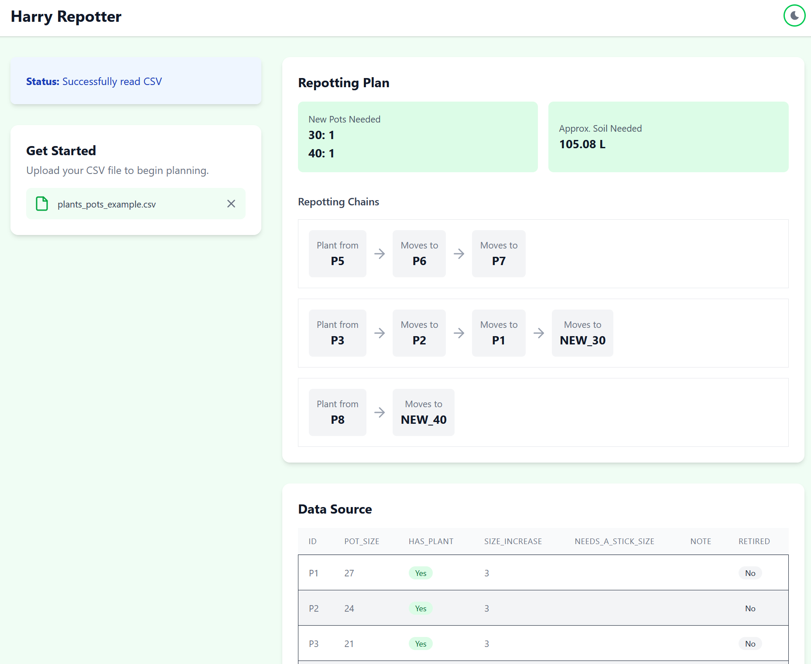

# Harry Repotter

> [!NOTE]
> This project was mostly done as a learning experience about TypeScript and frontend (mostly React).

A web application to help organize and plan repotting of plants. Harry Repotter allows you to upload your plant and pot data via CSV and generates an optimal repotting plan.




## Main Features
- **Repotting Plan Generation**: Automatically creates chains showing the optimal repotting sequence
- **Resource Planning**: Calculates new pots needed and approximate soil requirements


## Installation

1. Clone the repository:
   ```
   git clone https://github.com/klancar16/repotter.git
   cd harry-repotter
   ```

2. Install dependencies:
   ```
   npm install
   ```

3. Start the development server:
   ```
   npm run dev
   ```

4. Build for production:
   ```
   npm run build
   ```

## Usage

1. **Prepare your CSV file** with the following columns:
    - `id`: Unique identifier for each pot
    - `pot_size`: Current pot size (diameter in cm)
    - `has_plant`: Whether the pot currently contains a plant (boolean)
    - `size_increase`: How many cm larger the new pot should be (0 if no repotting needed)
    - `needs_a_stick_size`: Size of support stick needed (if any)
    - `note`: Any additional notes
    - `retired`: Whether the pot is retired/no longer in use (boolean)

2. **Upload your CSV** using the file upload interface

3. **View your repotting plan**:
    - See chains of pots showing the repotting sequence
    - Review summary information about new pots needed and soil requirements
    - Examine your source data in the table view

## Project Structure

- `src/`: Source code
    - `assets/`: Icons and other static assets
    - `context/`: React context for state management
    - `types/`: TypeScript type definitions
    - Component files (App, Table, CsvParser, etc.)
- `public/`: Static files
- Configuration files for TypeScript, ESLint, etc.

## AI Contributions to This Project

This project has benefited from AI assistance in some ways:

- **Code Review**: AI was used to review the codebase, identify potential issues, and suggest improvements for code quality and performance.
- **UI/UX Design**: AI helped generate ideas for the application's interface and user experience flow.
- **Documentation**: AI assisted in creating comprehensive documentation, including this README.
- **Refactoring**: AI provided suggestions for code refactoring to improve maintainability and readability.
- **Testing**: AI helped identify edge cases and potential bugs that should be covered in tests.
